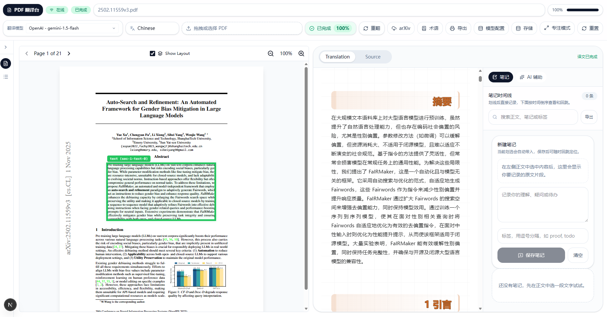

<div align="center">
  
  <h1>乖积 PDF</h1>
  <p><strong>把论文 PDF 变成可解析、可翻译、可对话、可批注的研究工作台。</strong></p>
  <p>
    <strong>乖积 PDF</strong> 是一个面向研究阅读与知识整理场景的桌面式 Web 工作台，
    工程仓库名为 <code>Doti</code>。
    它把 <code>MinerU</code>、多模型翻译、术语库、批注、AI 辅助和
    <code>@chenglou/pretext</code> 流式布局优化串成一条完整工作流。
  </p>
  <p>
    
    
    
    
    
  </p>
  <p>
    <a href="#快速开始"><strong>快速开始</strong></a>
    ·
    <a href="#当前亮点"><strong>功能亮点</strong></a>
    ·
    <a href="#核心工作流"><strong>核心工作流</strong></a>
    ·
    <a href="#技术栈"><strong>技术栈</strong></a>
    ·
    <a href="#当前状态"><strong>项目状态</strong></a>
    ·
    <a href="https://github.com/l-moze/Doti/issues"><strong>提交反馈</strong></a>
  </p>
  <p><sub>PDF Parsing · Streaming Translation · Notes & Glossary · AI Assist · Print / Export</sub></p>
</div>

> 目标不是再做一个“把 PDF 丢给模型翻一下”的工具，而是把论文处理成一个可持续阅读、持续追问、持续沉淀知识的研究工作台。

| 解析底座 | 翻译能力 | 阅读工作台 |
| --- | --- | --- |
| `MinerU` 保留 Markdown / HTML / LaTeX / layout 等结构化结果 | 支持 `Gemini / OpenAI / Claude / DeepSeek / GLM / Ollama / DeepLX` | 原文对照、批注、术语库、AI 连续追问、历史恢复、打印导出 |

<p align="center">
  
</p>
<p align="center"><sub>首页工作台截图</sub></p>

## 简介

乖积 PDF 是一个面向论文阅读与知识整理场景的 PDF 工作台。

它不只是把 PDF 丢给模型翻一下，而是把整条链路串起来：

- `MinerU` 负责把 PDF 拆成结构化 Markdown / HTML / LaTeX / layout 结果
- 多模型翻译负责把论文内容按块流式翻出来
- 批注、术语库、AI 辅助让你边读边问、边改边记
- `@chenglou/pretext` 负责优化流式正文阶段的布局稳定性

一句话说，这个项目的目标是把“论文翻译工具”做成“研究阅读工作台”。

## 当前亮点

- PDF 上传与 `arXiv` 导入
- `MinerU` 解析，保留 Markdown / HTML / LaTeX 等结果
- 原文 / 译文双工作区阅读
- 多模型翻译：`Gemini / OpenAI / Claude / DeepSeek / GLM / Ollama`
- 自定义 `OpenAI-compatible` Provider Profile
- `DeepLX` 翻译引擎接入
- 流式翻译、断点续传、重新翻译
- 笔记、批注、术语库、历史记录、本地持久化
- AI 辅助会话：选区继承、上下文锁定、连续追问
- 打印 / 导出视图
- 基于 `pretext` 的流式正文布局优化

## 核心工作流

1. 上传 PDF，或通过 `arXiv` 导入论文。
2. 服务端调用 `MinerU` 解析，落盘到 `uploads/<hash>/`。
3. 前端读取 `full.md / layout.json / images` 等资源进入阅读工作区。
4. 选择翻译模型，开始流式翻译。
5. 在译文工作区中继续做批注、术语修正、AI 问答和导出。

## 技术栈

- `Next.js 16`
- `React 19`
- `TypeScript`
- `Tailwind CSS 4`
- `Zustand`
- `Dexie`
- `react-pdf`
- `react-markdown + remark/rehype + KaTeX`
- `@chenglou/pretext`

## 快速开始

1. 安装依赖

```bash
npm install
```

2. 创建环境变量文件

```bash
cp .env.example .env.local
```

Windows PowerShell 下可以直接手动新建 `.env.local`。

3. 启动开发环境

```bash
npm run dev
```

4. 打开

```text
http://localhost:3000
```

## 环境变量

最少需要：

```env
MINERU_API_KEY=your_mineru_key
```

常用可选项：

```env
# LLM providers
GEMINI_API_KEY=
OPENAI_API_KEY=
ANTHROPIC_API_KEY=
DEEPSEEK_API_KEY=
GLM_API_KEY=

# Compatible gateways / local inference
OLLAMA_BASE_URL=http://localhost:11434/v1
ANTHROPIC_BASE_URL=
ANTHROPIC_MAX_OUTPUT_TOKENS=8192

# Translation runtime
TRANSLATION_CONCURRENCY=2

# MinerU extraction options
MINERU_ENABLE_FORMULA=true
MINERU_ENABLE_TABLE=true
MINERU_LANGUAGE=
MINERU_EXTRA_FORMATS=html,latex
MINERU_MODEL_VERSION=vlm
MINERU_IS_OCR=
MINERU_PAGE_RANGES=

# Optional build output override
NEXT_DIST_DIR=.next-build-check
```

说明：

- `MINERU_API_KEY` 必填，没有它无法解析 PDF。
- `DeepLX` 当前通过 UI 中的自定义 Provider Profile 配置，不依赖固定环境变量。
- 自定义 Provider Profile、术语库、批注、AI 会话等数据默认保存在浏览器 `IndexedDB`。

## pretext 说明

项目已经不再把 `pretext` 仅仅当成“统计行数工具”。

当前正文流式链路采用的是“主线程 authoritative layout + block projection + virtualization”的思路，主要目标是：

- 避免流式输出时正文列宽异常变窄
- 避免 token 级更新拖着整页频繁重排
- 让纯文本 draft 态切到 Markdown 终态时更平滑

## 仓库结构

```text
src/app/                     # 页面与 API 路由
src/components/              # 工作台 UI、阅读器、对话面板、模型配置
src/hooks/                   # 布局、交互 hooks
src/lib/                     # 翻译、MinerU、Pretext、缓存、数据库、Provider 抽象
public/                      # 静态资源、图标、打印样式
terms/                       # 内置术语 CSV
themes/                      # 主题样式
uploads/                     # 本地解析产物（默认忽略）
.cache/                      # 本地缓存（默认忽略）
```

## 常用命令

```bash
npm run dev
npm run build
npm run start
npm run lint
npx tsc --noEmit
```

## Windows 提示

如果 `npm run build` 出现：

```text
EPERM: operation not permitted, scandir '.next-build-check/types'
```

通常不是代码错误，而是本地还有 `next dev` 进程占用了构建目录。先关闭开发服务器，再重新执行构建即可。

## 当前状态

项目仍在高频迭代中，当前更偏研究型原型 / 工作台阶段，但主链路已经可用：

- 能解析 PDF
- 能流式翻译
- 能做批注和 AI 辅助
- 能恢复历史与部分本地状态

如果你想把它继续推进成公开可维护项目，下一步最值得补的是：

- 首页截图 / GIF
- License
- 更细的部署文档
- 自动化测试与 CI
